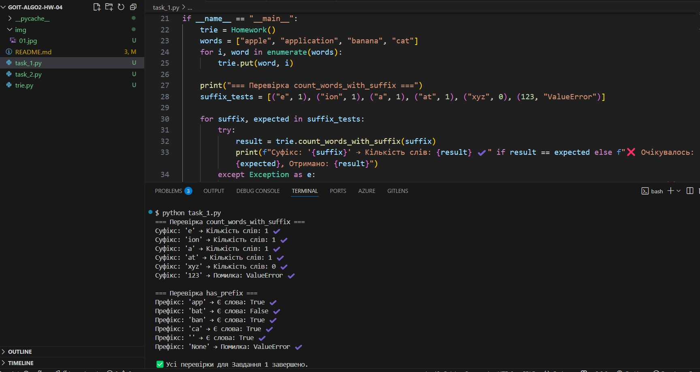
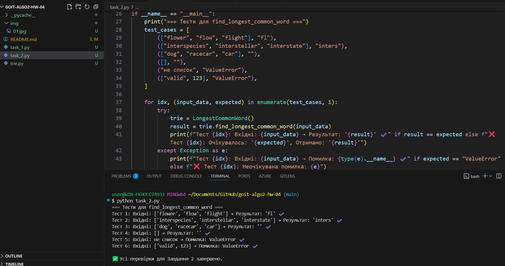

# goit-algo2-hw-04

# Домашнє завдання: Префіксні дерева (Trie)

## Структура

- `trie.py` — базова реалізація Trie
- `task_1.py` — Завдання 1 (методи count_words_with_suffix, has_prefix)
- `task_2.py` — Завдання 2 (метод find_longest_common_word)

## Задача 1. Розширення функціоналу префіксного дерева

Реалізуйте два додаткових методи для класу Trie:

count_words_with_suffix(pattern) для підрахунку кількості слів, що закінчуються заданим шаблоном;
has_prefix(prefix) для перевірки наявності слів із заданим префіксом.

Технічні умови

Клас Homework має успадковувати базовий клас Trie.
Методи повинні опрацьовувати помилки введення некоректних даних.
Вхідні параметри обох методів мають бути рядками.
Метод count_words_with_suffix має повертати ціле число.
Метод has_prefix має повертати булеве значення.

Критерії прийняття

📌Критерії прийняття домашнього завдання є обов’язковою умовою розгляду завдання ментором. Якщо якийсь із критеріїв не виконано, ментор надішле ДЗ на доопрацювання без оцінювання. Якщо вам «тільки уточнити»😉 або ви застопорилися на якомусь з етапів виконання — звертайтеся до ментора у Slack).

1. Метод count_words_with_suffix повертає кількість слів, що закінчуються на заданий pattern. За відсутності слів повертає 0. Враховує регістр символів (10 б).

2. Метод has_prefix повертає True, якщо існує хоча б одне слово із заданим префіксом. Повертає False, якщо таких слів немає. Враховує регістр символів (10 б).

3. Код проходить усі тести (10 б).

4. Обробляються некоректні вхідні дані (10 б).

5. Методи працюють ефективно на великих наборах даних (10 б).

Шаблон програми

from trie import Trie

class Homework(Trie):
def count_words_with_suffix(self, pattern) -> int:
pass

    def has_prefix(self, prefix) -> bool:
       pass

if **name** == "**main**":
trie = Homework()
words = ["apple", "application", "banana", "cat"]
for i, word in enumerate(words):
trie.put(word, i)

    # Перевірка кількості слів, що закінчуються на заданий суфікс
    assert trie.count_words_with_suffix("e") == 1  # apple
    assert trie.count_words_with_suffix("ion") == 1  # application
    assert trie.count_words_with_suffix("a") == 1  # banana
    assert trie.count_words_with_suffix("at") == 1  # cat

    # Перевірка наявності префікса
    assert trie.has_prefix("app") == True  # apple, application
    assert trie.has_prefix("bat") == False
    assert trie.has_prefix("ban") == True  # banana
    assert trie.has_prefix("ca") == True  # cat

## Запуск

python task_1.py

## Рішення

## Задача 2. Пошук найдовшого спільного префікса

Створіть клас LongestCommonWord, який наслідує клас Trie, та реалізуйте метод find_longest_common_word, який знаходить найдовший спільний префікс для всіх слів у вхідному масиві рядків strings.
Технічні умови
Клас LongestCommonWord має успадковувати Trie.
Вхідний параметр методу find_longest_common_word, strings — масив рядків.
Метод find_longest_common_word має повертати рядок — найдовший спільний префікс.
Час виконання — O(S)O(S), де S — сумарна довжина всіх рядків.

Критерії прийняття

1. Метод find_longest_common_word:

повертає найдовший префікс, спільний для всіх слів (10 б),
повертає пустий рядок, якщо спільного префікса немає (10 б),
коректно обробляє порожній масив або некоректні вхідні дані (10 б). 2. Код проходить усі тести (20 б).

Шаблон програми

from trie import Trie

class LongestCommonWord(Trie):

    def find_longest_common_word(self, strings) -> str:
        pass

if **name** == "**main**": # Тести
trie = LongestCommonWord()
strings = ["flower", "flow", "flight"]
assert trie.find_longest_common_word(strings) == "fl"

    trie = LongestCommonWord()
    strings = ["interspecies", "interstellar", "interstate"]
    assert trie.find_longest_common_word(strings) == "inters"

    trie = LongestCommonWord()
    strings = ["dog", "racecar", "car"]
    assert trie.find_longest_common_word(strings) == ""

## Запуск

python task_2.py

## Рішення

